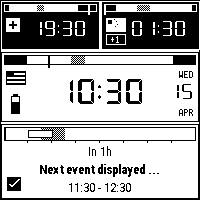
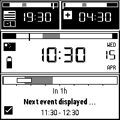
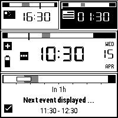
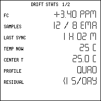
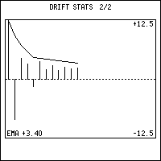

# watchy-multitz

A multi-timezone watchface for the [SQFMI Watchy](https://watchy.sqfmi.com/)
(ESP32, 1.54" e-paper, 200 × 200 1-bit) — three zones at a glance,
BLE-synced calendar events, crystal drift compensation, and on-demand
QR codes. Designed around a small HAL so the face code runs unchanged
on the desktop simulator and is straightforward to drop onto a
different 1-bit watch.

<p align="center">
  
  
  
</p>

---

## Visual tour

### Watchface

Three timezones, simultaneously. The big card is the "home" zone; the
two strips above are the other two. Each card has its own day-bar
(work / lunch / night schedule) with a "now" pin. Cards invert when
their zone is in night hours, so a glance tells you who's awake.

<p align="center">
  
  
  
  
</p>

### Upcoming events

The bottom card is an 8-hour agenda strip. Events from the paired
phone (via BLE) appear as hatched blocks on the schedule-shaded
timeline; hourly ticks below the bar make position-to-time readable
without math. The card itself inverts when an event is currently
in progress.

<p align="center">
  
</p>

### Sync feedback (in-face, no vibration)

A small badge next to the main clock shows sync state: three dots
while BLE is open, check on success, cross on failure. Held for 2 s,
then cleared.

<p align="center">
  
  
  
</p>

### Drift compensation — software TCXO

A port of [Sensor-Watch's Nanosec/Finetune](https://github.com/joeycastillo/Sensor-Watch)
algorithm learns the crystal's frequency offset from successive NTP
brackets, plus a quadratic temperature model. Accessible under the
MENU button on the watch; renders a summary and a ppm history graph.

<p align="center">
  
  
</p>

### QR codes on demand

Pre-baked QR codes accessed from the watchface via the BACK button.
Each press cycles to the next; 30 s idle or pressing past the last
code returns to the watchface. Matrices are stored raw (~165 B each)
and scaled at render time — no pre-scaled bitmaps. All codes in the
cycle share the same QR version, so each one renders at an identical
physical size.

<p align="center">
  
  
</p>

Regenerate from your own source images:

```sh
# Drop your QR images into tools/qr_sources/  (gitignored — kept private)
python3 tools/gen_qr_codes.py
```

The tool decodes each image with `zbarimg`, then re-encodes the
payload with `qrencode` at the smallest *shared* version that lets
every code fit at **at least ECC Q**. Within that shared version,
each code takes the strongest ECC level it can — shorter payloads
get extra scan robustness for free, and all codes come out the same
visual size.

On a clean clone, the generator falls back to
`tools/qr_sources_example/` (committed) so the firmware builds
out of the box with placeholder codes.

---

## Buttons

| Button       | Short press (watchface)        | Long press (≥ 2 s) |
|--------------|--------------------------------|--------------------|
| UP           | Cycle to next "home" zone      | —                  |
| DOWN         | Cycle event-card selection     | Force BLE sync now |
| MENU         | Drift-stats overlay            | —                  |
| BACK         | QR-code cycle                  | —                  |

(Exact physical positions depend on your Watchy revision's button
wiring; the *logical* names above match the `Button::*` enum.)

---

## Architecture

The face code is strictly platform-agnostic. Everything hardware-facing
goes through one of eight thin HAL interfaces; a Watchy platform shim
and a desktop-sim shim both implement them.

```
                 ┌────────────────────────────────────────────┐
                 │        sketches/WatchyMultiTZ/src/face     │
                 │                                            │
                 │   WatchFace  (orchestrator, no hardware)   │
                 │       │                                    │
                 │       ├── TimeZoneCard   DayBar            │
                 │       ├── EventCard      EventBar          │
                 │       ├── DriftTracker   DriftStatsScreen  │
                 │       └── QrScreen                         │
                 └──────────────────────┬─────────────────────┘
                                        │  (HAL pointers only)
                  ┌─────────────────────┴──────────────────────┐
                  │                                            │
                  ▼                                            ▼
   src/hal/ — 8 pure-virtual interfaces                        │
                                                               │
    IDisplay   IClock    IButtons   IPower                     │
    INetwork   IEventProvider   IPersistentStorage             │
    IThermometer                                               │
                  ▲                                            ▲
                  │                                            │
    ┌─────────────┴──────────────┐              ┌──────────────┴──────────────┐
    │ src/platform/watchy/       │              │ sim/                        │
    │   WatchyDisplay  →  GxEPD2 │              │   SimDisplay   → PNG out    │
    │   WatchyClock    →  RTC    │              │   SimClock     → wall time  │
    │   WatchyButtons  →  GPIO   │              │   SimButtons   → stub       │
    │   WatchyPower    →  BMA4   │              │   SimPower     → fake Vbat  │
    │   WatchyNetwork  →  WiFi   │              │   SimNetwork   → stub       │
    │   BleEventProvider → BLE   │              │   SimEventProvider → inject │
    │   WatchyStorage  →  NVS    │              │   SimStorage   → in-mem     │
    │   WatchyThermometer → BMA  │              │   SimThermometer → fixed °C │
    └────────────────────────────┘              └─────────────────────────────┘
                  │                                            │
                  ▼                                            ▼
              ESP32 + e-paper                               multitzsim → PNG
```

The `WatchFace` class and every card/overlay in `src/face/` compile
identically for device and sim; only the adapters differ. This is also
why the sim can render every screen that exists on the watch — including
the QR cycle — from a single static PNG frame.

---

## Adapting to another watch

The HAL is small enough that porting to a different 1-bit e-paper watch
is mostly mechanical. Checklist:

1. **Implement the 8 interfaces** in a new `src/platform/<yourwatch>/`:
   `IDisplay`, `IClock`, `IButtons`, `IPower`, `INetwork`,
   `IEventProvider`, `IPersistentStorage`, `IThermometer`. Headers are
   in `sketches/WatchyMultiTZ/src/hal/`; use the Watchy shim as a
   reference — each adapter is under 100 lines.
2. **Write a thin entry point** analogous to `WatchyMultiTZ.ino` that
   instantiates your HAL adapters, builds a `WatchFaceDeps`, and
   forwards wake events to `WatchFace::onWake()`.
3. **Map your buttons** to the `Button` enum in `src/hal/Types.h`.
   That's the only place button semantics are named.
4. **Override font choices / layout constants** if your display is a
   different size — the face code reads `IDisplay::width()/height()`
   and does no hard-coded 200 × 200 geometry outside the card slot
   table.

No changes are needed to `WatchFace`, the cards, `DriftTracker`,
`QrScreen`, or any file under `src/face/`. The simulator is the
primary regression harness — get it rendering your layout in the sim
before you flash.

---

## Build & flash (Watchy v2.0)

Requires `arduino-cli`, ESP32 core 2.0.17, Watchy library 1.4.15, and
the deps listed in `sketches/WatchyMultiTZ/README.md`.

```sh
# If qr_codes.h isn't already there (fresh clone), generate it from
# the placeholder sources in tools/qr_sources_example/:
python3 tools/gen_qr_codes.py

arduino-cli compile \
  --fqbn 'esp32:esp32:watchy:Revision=v20,PartitionScheme=min_spiffs' \
  --build-property "compiler.cpp.extra_flags=-I{build.source.path}/src -std=gnu++17" \
  --output-dir build/MultiTZ_v20 \
  sketches/WatchyMultiTZ

arduino-cli upload \
  --fqbn 'esp32:esp32:watchy:Revision=v20,PartitionScheme=min_spiffs,UploadSpeed=115200' \
  --port /dev/ttyUSB0 \
  --input-dir build/MultiTZ_v20 \
  sketches/WatchyMultiTZ
```

Hardware was identified as the v2.0 button wiring (UP on GPIO 35) even
though it shipped in a v1.5-style plastic case. If wake on UP doesn't
work, try `Revision=v15`.

## Simulator

```sh
cd sim
make
./multitzsim --time 2026-04-15T10:30 --main-idx 2 --out out/face.png
./multitzsim --screen drift --page 1 --out out/drift.png
./multitzsim --screen qr    --qr-idx 0 --out out/qr.png
./multitzsim --sync busy    --out out/busy.png
```

| Flag                       | Meaning                                |
|----------------------------|----------------------------------------|
| `--time YYYY-MM-DDTHH:MM`  | Wall-clock time in the selected main zone |
| `--main-idx 0\|1\|2`       | Which zone is the main card           |
| `--battery <V>`            | Fake battery voltage for the gauge    |
| `--screen face\|drift\|qr` | Which screen to render                |
| `--page 0\|1`              | Drift-stats page                      |
| `--qr-idx N`               | QR index (0..QR_COUNT-1)              |
| `--sync none\|busy\|ok\|fail` | Force the main-clock sync badge    |
| `--temp C`                 | Fixed thermometer reading (drift math)|
| `--out PATH`               | PNG output path                       |

---

## Repo layout

```
sketches/WatchyMultiTZ/       custom multi-timezone watchface sketch
    src/hal/                  8 platform-agnostic interfaces
    src/face/                 card renderers, screens, drift tracker
        cards/                TimeZoneCard, EventCard
    src/platform/watchy/      concrete HAL impls for the Watchy
    src/assets/               flags, icons, QR matrices (generated)
    src/fonts/                DSEG7 + RobotoCond + custom 4×7
sim/                          desktop simulator (Makefile + sim HAL impls)
tools/
    gen_qr_codes.py           decode source images → re-encode → emit .h
    qr_sources/               YOUR QR images (gitignored)
    qr_sources_example/       placeholder QR images (committed)
Watchy/                       upstream sqfmi/Watchy v1.4.15 (gitignored)
backup/                       flash snapshots with SHA-256s
```

---

## Privacy note on QR codes

`tools/qr_sources/`, `sketches/WatchyMultiTZ/src/assets/qr_codes.h`,
and `docs/img/qr_*.png` (except `qr_example_*.png`) are all
`.gitignored`. A fresh clone compiles using the placeholder codes
under `tools/qr_sources_example/`. Your private codes (WhatsApp,
WeChat, vCards, Wi-Fi join strings, etc.) stay local — they're
baked into the flash on the device but never hit the repo.

---

## Credits

- [sqfmi/Watchy](https://github.com/sqfmi/Watchy) — hardware platform
  + Arduino library (BSD 2-Clause).
- [Sensor-Watch](https://github.com/joeycastillo/Sensor-Watch) —
  Nanosec/Finetune drift compensation algorithm, by Mikhail
  Svarichevsky (MIT).
- [zbar](https://github.com/mchehab/zbar) +
  [qrencode](https://fukuchi.org/works/qrencode/) — QR decode/encode
  toolchain (both used only at build time).
- DSEG7 fonts by Keshikan (SIL OFL).
