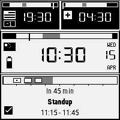
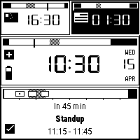
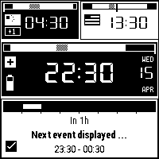
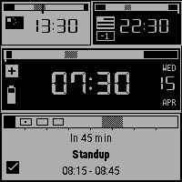
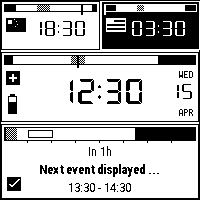
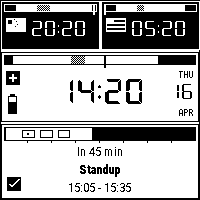
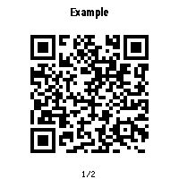
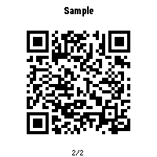

# watchy-multitz

Multi-timezone watchface for the [SQFMI Watchy](https://watchy.sqfmi.com/)
(ESP32, 1.54" e-paper, 200 x 200, 1-bit).

- Three zones on screen at once. UP cycles which is "home".
- 8-hour agenda strip fed over BLE from the paired phone.
- Crystal drift compensation (Sensor-Watch Nanosec port).
- On-demand QR codes under the BACK button.
- 8-interface HAL — same face code runs on the watch and the desktop sim.

<p align="center">
   SFO -> ZRH)" width="240"/>
</p>

---

## Watchface

Big card = home zone. Two strips above = the others. Each card carries its
own day-bar (work / lunch / night) with a "now" pin. Cards invert during
their zone's night hours; the now-pin sweeps the bar across the day.

<p align="center">
  
  
   noon -> evening -> night" width="180"/>
</p>
<p align="center"><sub>day&nbsp;&nbsp;/&nbsp;&nbsp;night&nbsp;&nbsp;/&nbsp;&nbsp;24 h cycle</sub></p>

## Agenda + sync

Bottom card spans 8 hours. Events arrive over BLE and render as hatched
blocks on a schedule-shaded timeline; hourly ticks make position-to-time
readable without math. Card inverts while an event is active. Badge next
to the clock shows BLE state; held 2 s then cleared. DOWN long-press
forces an immediate sync.

<p align="center">
  
   ok -> cleared" width="200"/>
</p>
<p align="center"><sub>active event (hatched)&nbsp;&nbsp;/&nbsp;&nbsp;sync badge states</sub></p>

## Drift compensation

Port of [Sensor-Watch's Nanosec/Finetune](https://github.com/joeycastillo/Sensor-Watch).
Learns the crystal's frequency offset from successive NTP brackets, plus
a quadratic temperature model. MENU opens it; the overlay pages between
stats and a residuals graph.

<p align="center">
   2/2" width="180"/>
</p>

## QR codes

Pre-baked codes under the BACK button. Each press cycles to the next;
30 s idle (or pressing past the last) returns to the watchface. Matrices
are stored raw (~165 B each) and scaled at render time. All codes in the
cycle share one QR version so they render at identical physical size.

<p align="center">
  
  
</p>

```sh
# Drop your QR images into tools/qr_sources/ (gitignored), then:
python3 tools/gen_qr_codes.py
```

The tool decodes each image with `zbarimg`, re-encodes via `qrencode` at
the smallest *shared* version that fits every payload at >= ECC Q, then
within that version picks the strongest ECC level each code can take —
shorter payloads get extra robustness for free, all stay the same visual
size. Falls back to `tools/qr_sources_example/` on a clean clone so the
firmware builds out of the box.

---

## Buttons

| Button | Short press                | Long press (>= 2 s) |
|--------|----------------------------|---------------------|
| UP     | Cycle home zone            | -                   |
| DOWN   | Cycle event-card selection | Force BLE sync now  |
| MENU   | Drift-stats overlay        | -                   |
| BACK   | QR cycle                   | -                   |

Logical names match the `Button::*` enum; physical positions depend on
your Watchy revision.

---

## Architecture

Face code is platform-agnostic. Every hardware touchpoint goes through
one of 8 thin HAL interfaces; both the Watchy shim and the desktop sim
implement them.

```
   sketches/WatchyMultiTZ/src/face/   -- no hardware deps
       WatchFace (orchestrator)
         +- TimeZoneCard   DayBar
         +- EventCard      EventBar
         +- DriftTracker   DriftStatsScreen
         +- QrScreen
                  |  (HAL pointers only)
                  v
   src/hal/   -- 8 pure-virtual interfaces
       IDisplay  IClock  IButtons  IPower  INetwork
       IEventProvider  IPersistentStorage  IThermometer
                  ^                              ^
                  |                              |
   src/platform/watchy/             sim/
     WatchyDisplay  -> GxEPD2         SimDisplay   -> PNG
     WatchyClock    -> RTC            SimClock     -> wall time
     WatchyButtons  -> GPIO           SimButtons   -> stub
     WatchyPower    -> BMA4           SimPower     -> fake Vbat
     WatchyNetwork  -> WiFi           SimNetwork   -> stub
     BleEventProvider -> BLE          SimEventProvider -> inject
     WatchyStorage  -> NVS            SimStorage   -> in-mem
     WatchyThermometer -> BMA         SimThermometer -> fixed C
                  |                              |
                  v                              v
           ESP32 + e-paper              multitzsim -> PNG
```

Same `WatchFace` and every card compile identically for device and sim;
only the adapters differ. Every PNG and GIF in this README came out of
the sim.

---

## Porting to another 1-bit watch

1. Implement the 8 interfaces under `src/platform/<yourwatch>/`. Watchy
   adapters are each < 100 lines.
2. Thin entry point analogous to `WatchyMultiTZ.ino`: instantiate
   adapters, build `WatchFaceDeps`, forward wake to `WatchFace::onWake()`.
3. Map your buttons to the `Button` enum in `src/hal/Types.h`.
4. If the panel isn't 200 x 200, override font / layout constants. Face
   code reads `IDisplay::width()/height()`; no hard-coded geometry lives
   outside the card slot table.

Nothing under `src/face/` needs touching. Sim first, flash second.

---

## Build & flash (Watchy v2.0)

Needs `arduino-cli`, ESP32 core 2.0.17, Watchy library 1.4.15. Other deps
in `sketches/WatchyMultiTZ/README.md`.

```sh
# Generate qr_codes.h on a fresh clone (placeholder sources):
python3 tools/gen_qr_codes.py

arduino-cli compile \
  --fqbn 'esp32:esp32:watchy:Revision=v20,PartitionScheme=min_spiffs' \
  --build-property "compiler.cpp.extra_flags=-I{build.source.path}/src -std=gnu++17" \
  --output-dir build/MultiTZ_v20 \
  sketches/WatchyMultiTZ

arduino-cli upload \
  --fqbn 'esp32:esp32:watchy:Revision=v20,PartitionScheme=min_spiffs,UploadSpeed=115200' \
  --port /dev/ttyUSB0 \
  --input-dir build/MultiTZ_v20 \
  sketches/WatchyMultiTZ
```

Hardware here is v2.0 button wiring (UP on GPIO 35) inside a v1.5-style
case. If wake-on-UP misbehaves, try `Revision=v15`.

## Simulator

```sh
cd sim && make
./multitzsim --time 2026-04-15T10:30 --main-idx 2 --out out/face.png
# flags: --battery V  --screen face|drift|qr  --page 0|1  --qr-idx N
#        --sync none|busy|ok|fail  --temp C  --out PATH
```

---

## Repo layout

```
sketches/WatchyMultiTZ/   watchface sketch
  src/hal/                  8 platform-agnostic interfaces
  src/face/                 cards, overlays, drift tracker
  src/platform/watchy/      Watchy HAL impls
  src/assets/               flags, icons, QR matrices (generated)
  src/fonts/                DSEG7 + RobotoCond + custom 4x7
sim/                      desktop simulator
tools/gen_qr_codes.py     decode source images -> re-encode -> .h
tools/qr_sources{,_example}/  private images (gitignored) / placeholders
Watchy/                   upstream sqfmi/Watchy v1.4.15 (gitignored)
backup/                   flash snapshots with SHA-256s
```

`tools/qr_sources/`, `src/assets/qr_codes.h`, and `docs/img/qr_*.png`
(except `qr_example_*.png`) are gitignored. Your real QR codes never
hit the repo; they're baked into flash on the device.

## Credits

- [sqfmi/Watchy](https://github.com/sqfmi/Watchy) — hardware + library (BSD 2-Clause).
- [Sensor-Watch](https://github.com/joeycastillo/Sensor-Watch) — Nanosec/Finetune drift algorithm, Mikhail Svarichevsky (MIT).
- [zbar](https://github.com/mchehab/zbar) + [qrencode](https://fukuchi.org/works/qrencode/) — QR toolchain (build time only).
- DSEG7 fonts by Keshikan (SIL OFL).
